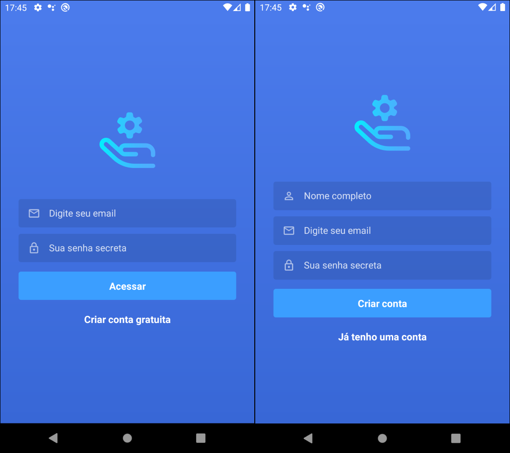
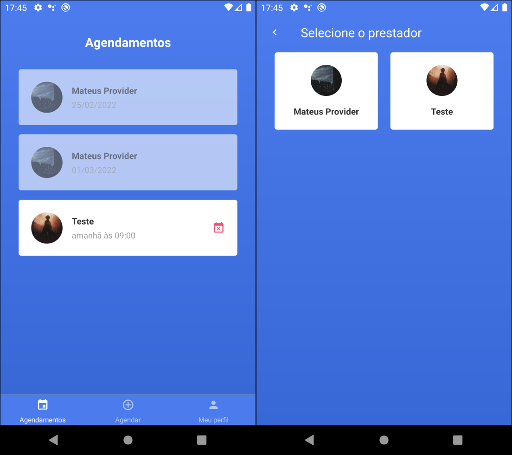

# app_service_provider_mobile

## What he does?

This is the mobile part of the app for providers customers to be able to select a time for a service. The server part can be found [here](https://github.com/mateusgiroletti/app-service-provider-server.git). And the web part can be found [here](https://github.com/mateusgiroletti/app-service-provider-web.git).

## What is your use?

It is intended to apply the knowledge obtained in courses and tutorials on the internet using React Native technologies and its environment, such as components, states, state managers, style and API consumption.

## Screenshots

Here you can have a preview of the screens.

## Sign In And Sign Up

Login screen.



## Schedules

On the first screen it is possible to see the appointments, cancel any that have not passed the time and create a new one. On the screen to the side, in the "schedule" menu, you can select the provider you want.



## New Schedule

On the first screen you can choose the day and time available to schedule the service, and after that the app will ask you to confirm this time.


## Profile

This is the profile screen, here you can change your name, email, password or exit the app.


## How to use?

Clone this project on your favorite dir:

```console
git clone https://github.com/mateusgiroletti/app_service_provider_mobile.git
```

Change to the root directory and install the necessary packages:

```console
cd app-service-provider-web/ && npm install
```

To run on android.

```console
npx react-native run-android && npx react-native start
```

## Contact

If you find any errors, feel free to open an issue. If you want to talk to me personally by [Email](mailto:mateusgiroletti97@gmail.com) or [LinkedIn](https://www.linkedin.com/in/mateus-vinicios-sorgatto-giroletti-7a0647182/)
